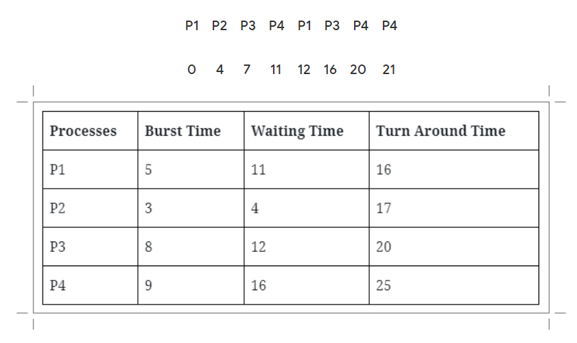

# Lab 3 - Round Robin

## info

We can Understand Round Robin Scheduling Algorithm by taking an example Suppose there is 4 process. and each process comes at the same time so based on FIFO(First in First Out) scheduler keep all process in Ready Queue and forgiven time Slice each process will be executed until all process finish. Let's take an example and try to understand How Round Robin Works.

### For Example

We will have quantum = 4

Now Schedular keeps all process in Ready Queue and based on FIFO(First in First Out) send the first process for execution.

Average waiting time = 10.75
Average turn around time = 17

#### What is Round Robin Scheduling Algorithm?

Round Robin is a primitive Scheduling Algorithm and most important and commonly used scheduling algorithm for CPU. In Round Robin Scheduling Algorithm each process has its own execution time that is called "Quantum".

After Quantum time next process start executes for given Quantum time and so on once a cycle complete again process execution start from first, process and repeat the process again and again and for saving a current state of process Context switching is used.returns NULL and does not destroy the old block of memory.

### How to Calculate Turn Around Time?
Turn Around Time = Completion Time – Arrival Time, With the help of this formula, we can calculate a Turn Around Time of all process in Queue.

### How to Calculate Waiting Time?

Waiting Time = Turn Around Time – Burst Time, This formula is used for calculating the waiting time for the rest of the process.

## DEMONSTRATION

We create 3 proceses :
1)
burst time of process 1: 3
prioryty 1: 10
2)
burst time of process 2: 9
prioryty 2: 1
3)
burst time of process 3: 5
prioryty 3: 5
and quantum=4
and we make..

